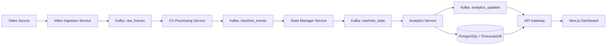
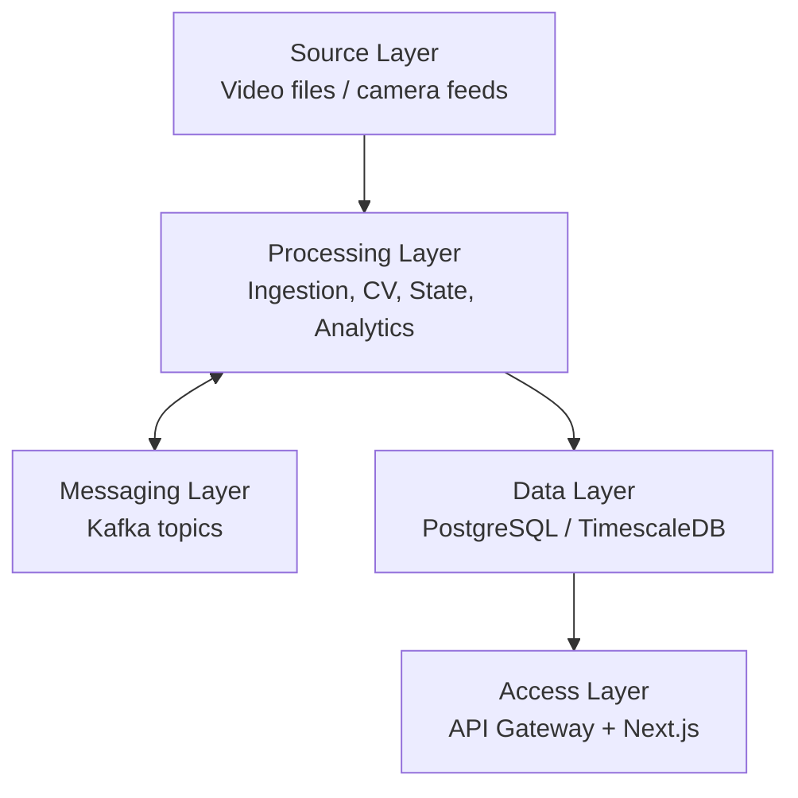
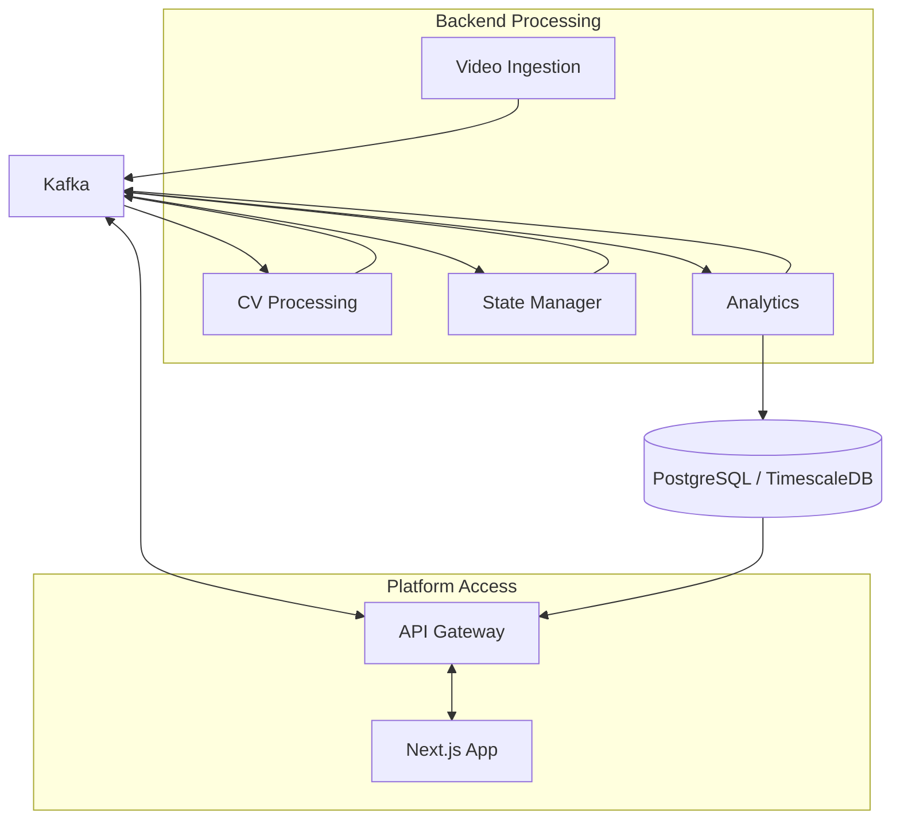
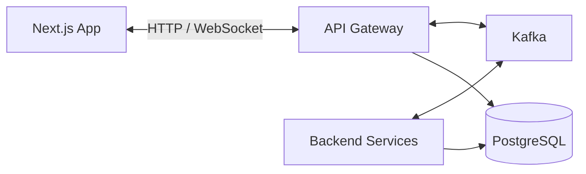
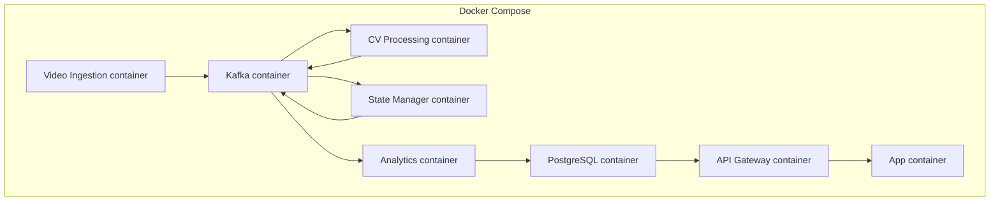

# Eaglevision Architecture

This document explains the Eaglevision project at a high level: what the main parts of the system are, how they communicate, and how data flows through the platform.

For **why** the project exists, the **problem**, and **assessment goals**, start with [`00-PROJECT-OVERVIEW.md`](00-PROJECT-OVERVIEW.md).

It is intentionally focused on architecture and system relationships, not on code-level implementation.

The goal is to help anyone on the team, especially junior engineers, understand the system before reading code.

---

## 1. Project purpose

Eaglevision is an equipment monitoring and utilization platform for construction-site video analysis.

Its main goal is to process incoming video, detect and track machines, classify their activity, calculate utilization and dwell time, store analytics, and expose the results to a web dashboard.

At a high level, the system is built around:

- **Video processing services** for ingestion, CV, state handling, and analytics
- **Apache Kafka** as the **main communication channel** — between **backend services** (each other) and between **frontend and backend** (via the API Gateway as the bridge; the browser does not speak the Kafka protocol directly)
- **PostgreSQL / TimescaleDB** for persistence and analytics storage
- **API Gateway** — participates in Kafka (consumes and produces topics) and **exposes the browser edge** (HTTP, WebSockets, or similar) so the dashboard can use the same event model
- **Next.js app** for dashboards and visualization
- **Docker / Docker Compose** for local orchestration and environment setup

### A simple way to think about the system

If you are new to event-driven systems, think about Eaglevision like a factory line:

- the **video source** is the raw material
- the **ingestion service** puts that material onto the conveyor belt
- the **CV service** looks at each frame and identifies machines
- the **state service** decides what those machines are doing over time
- the **analytics service** turns that activity into useful numbers
- the **database** stores the results
- **Kafka** is the shared spine for live data and commands; the **API gateway** connects the **dashboard** to that spine
- the **dashboard** shows the final view to users

That mental model is enough to understand most of the architecture.

---

## 2. Architectural style

Eaglevision follows a **distributed, event-driven microservice architecture**.

This means:

- Each backend service has a **single clear responsibility**
- Services communicate primarily through **Kafka topics**
- The **frontend and backend** are also aligned through **Kafka** (the gateway **bridges** the browser to topics; see below)
- Components are **loosely coupled**, so one part can evolve without tightly breaking others
- Data processing is handled as a **pipeline**, where each stage consumes input, enriches it, and produces the next event

This architecture is a good fit for video and analytics workloads because it supports:

- asynchronous processing
- clearer service boundaries
- better fault isolation
- future horizontal scaling
- replayable event streams

### What those words mean in simple terms

- **Distributed** means the system is split into multiple services instead of one large application.
- **Microservice architecture** means each service has a focused job.
- **Event-driven** means services pass messages and events to each other instead of calling each other directly all the time.

This matters because video processing is heavy work, and different parts of the pipeline may need to run at different speeds.

---

## 3. System overview diagram

### How to read this diagram

Read it from left to right:

1. video enters the system
2. backend services process it in stages
3. Kafka sits between those stages
4. analytics are stored in the database
5. the API gateway **consumes Kafka** (for example `analytics_updates`) and **reads the database**, then serves the dashboard
6. the frontend renders the results for users

---

## 4. High-level system layers

The system can be viewed in five layers.

### Why layers help

Layers help us reason about the system without thinking about every file or container at once.

- The **source layer** gives input
- The **processing layer** does the work
- The **messaging layer** moves events around
- The **data layer** stores long-term results
- The **access layer** shows those results to users

### 4.1 Source layer

This is where the raw input enters the system.

- Video files
- Live camera streams in the future
- External media sources

The responsibility of this layer is only to provide video input.

### 4.2 Processing layer

This layer contains the services that transform raw video into machine intelligence.

- **Video Ingestion Service**
- **CV Processing Service**
- **State Manager Service**
- **Analytics Service**

Together, these services turn frames into structured machine events and then into summarized operational metrics.

### 4.3 Messaging layer

This layer is the event backbone of the system.

- **Apache Kafka**

Kafka allows services to exchange data without directly depending on each other over synchronous request-response calls.

### 4.4 Data layer

This layer stores the processed outputs and historical information.

- **PostgreSQL / TimescaleDB**

This is the system of record for machine history, activity logs, and utilization analytics.

### 4.5 Access layer

This layer exposes the system to users.

- **API Gateway**
- **Next.js dashboard**

The frontend does not call internal processing services directly. It uses the **gateway**, which **participates in Kafka** and bridges the UI to the same event backbone as the services.

---

## 5. Core components

### 5.1 Video Ingestion Service

The Video Ingestion Service is the entry point into the backend pipeline.

Responsibilities:

- read video input
- split video into frames or frame batches
- attach metadata such as source and timestamp
- publish raw frame events to Kafka

This service does not perform analytics. Its role is to reliably move media into the event pipeline.

### 5.2 CV Processing Service

The CV Processing Service is responsible for computer vision inference.

Responsibilities:

- consume raw frames from Kafka
- run object detection
- run equipment tracking
- classify activity or movement state
- publish machine-level events back to Kafka

This service transforms visual data into structured machine observations.

### 5.3 State Manager Service

The State Manager Service converts low-level machine events into meaningful state transitions.

Responsibilities:

- maintain machine identity continuity
- determine active vs idle state
- compute dwell time and timing windows
- emit state summaries to Kafka

This is the layer where individual detections start becoming operational state.

### 5.4 Analytics Service

The Analytics Service converts state updates into metrics suitable for reporting and dashboards.

Responsibilities:

- aggregate machine state data
- calculate utilization statistics
- prepare historical analytics
- persist analytics into PostgreSQL / TimescaleDB
- optionally publish analytics update events

This service is focused on reporting-oriented data rather than raw CV output.

### 5.5 API Gateway

The API Gateway is the **browser-facing** entrypoint and a **first-class participant in Kafka**.

Responsibilities:

- **consume** relevant topics (for example `analytics_updates` and related streams) so dashboards receive **live, event-driven** updates
- **produce** Kafka messages when the UI must send commands or acknowledgements into the backend pipeline (exact topics are an implementation detail)
- expose **HTTP** (and optionally **WebSockets**) to the Next.js app — the **browser** uses normal web protocols; the gateway **translates** between those and Kafka
- read from PostgreSQL when serving historical or query-heavy views
- hide internal service topology from the frontend

The gateway is the only backend layer the frontend should depend on directly.

### 5.6 Next.js App

The Next.js app is the user-facing dashboard.

Responsibilities:

- display machine status and utilization
- render charts and dashboards
- present near-real-time updates
- allow operators or stakeholders to inspect machine behavior

The app is a **client** of the gateway. **Semantically**, end-to-end communication is **Kafka-driven**: the gateway connects the UI to the same **event backbone** the services use.

---

### 5.7 How the frontend fits Kafka (without running Kafka in the browser)

Browsers do not connect to Kafka brokers directly. The pattern is:

1. **Backend services** talk to Kafka over the **Kafka protocol**.
2. The **API Gateway** connects to Kafka as a **producer and consumer**.
3. The **Next.js app** talks to the gateway over **HTTP / WebSockets** (or similar).
4. So **Kafka remains the main communication channel** for the **system’s** semantics: frontend and backend stay aligned through **topics**, with the gateway as the bridge.

### Component relationship diagram

Kafka is the **shared backbone** for both the processing pipeline and the gateway’s **event-driven** link to the UI (see section 5.7).

---

## 6. Communication model

**Kafka is the main communication channel** in Eaglevision:

- **Backend ↔ Backend:** services publish and consume **Kafka topics** (the processing pipeline).
- **Frontend ↔ Backend:** the **API Gateway** connects the Next.js app to that same model — it **produces and consumes Kafka topics** and exposes **HTTP / WebSockets** to the browser. The browser never talks to Kafka directly, but **live behavior** is **Kafka-backed** through the gateway.

Other mechanisms play a **supporting** role:

- **PostgreSQL** — durable storage and queries (not the primary event bus).
- **HTTP / WebSockets** — **transport** between browser and gateway only; the **meaning** of live traffic is still tied to **Kafka topics** on the backend side.

### Why Kafka for both service and UI-facing traffic

- One **event model** for the whole system reduces mismatches between what operators see and what services process.
- The gateway can **subscribe** to topics such as `analytics_updates` and **push** equivalent updates to the dashboard.
- **Scaling** and **replay** stay coherent because the spine is the same broker network.

### Communication diagram

### Beginner-friendly rule of thumb

If you are ever unsure how two parts should talk:

- if it is **service to service**, think **Kafka topics**
- if it is **browser to backend**, think **API Gateway first**, then remember the gateway is **wired to Kafka** for the main event flow
- if it is **historical or queryable** business data, think **PostgreSQL**

---

## 7. Data flow

The main system data flow is a staged pipeline.

### 7.1 Step-by-step explanation

#### Step 1: Video enters the platform

The input video is accepted by the Video Ingestion Service.

At this point, the system still has raw visual data. Nothing has been interpreted yet.

#### Step 2: Frames are published

The ingestion service publishes frame-level data to the `raw_frames` topic.

This means the video is now available to downstream services without directly calling them.

#### Step 3: CV processing happens

The CV Processing Service consumes these frames, runs detection and tracking, and produces machine observation events.

This is where the system starts answering questions like:

- what machine is visible?
- where is it in the frame?
- is it moving or operating?

#### Step 4: Machine events are normalized into state

The State Manager Service receives machine events and determines whether machines are active, idle, or dwelling.

This step is important because a single frame is not enough to describe utilization. Real state comes from behavior over time.

#### Step 5: Analytics are generated

The Analytics Service consumes state data, computes metrics, and stores the results in the database.

This is where raw activity becomes dashboard-friendly information such as totals, percentages, and trends.

#### Step 6: Data is served to users

The API Gateway serves the dashboard: it may **read PostgreSQL** for historical or snapshot views, and it **consumes Kafka topics** (such as `analytics_updates`) so **live** behavior stays aligned with the pipeline. The browser talks only to the gateway; **Kafka remains the main channel** for event semantics between backend components and between gateway and pipeline.

#### Step 7: The dashboard presents insights

The Next.js app displays machine activity, dwell time, utilization trends, and other operational analytics.

This is the user-visible end of the pipeline.

### 7.2 "What happens to one frame?" example

It can help to follow one single frame through the system:

1. a frame is extracted from a video
2. that frame is sent to Kafka as part of `raw_frames`
3. the CV service reads it and detects a bulldozer
4. the CV service publishes a `machine_events` record
5. the state manager decides the bulldozer is idle
6. the analytics service updates idle-time metrics
7. the database stores the new numbers
8. the dashboard later reads and shows the updated utilization

---

## 8. Kafka's role in the architecture

Kafka is the core internal transport mechanism.

It is responsible for:

- decoupling services
- buffering data between stages
- allowing independent scaling of services
- enabling event replay
- improving resilience when downstream consumers are temporarily slow

### Planned topics

- `raw_frames`
- `machine_events`
- `machine_state`
- `analytics_updates`

### Topic intent

| Topic | Produced by | Consumed by | Purpose |
| ----- | ----------- | ----------- | ------- |
| `raw_frames` | Video Ingestion Service | CV Processing Service | move raw frame data into the CV pipeline |
| `machine_events` | CV Processing Service | State Manager Service | carry structured detections, tracking, and activity output |
| `machine_state` | State Manager Service | Analytics Service | carry machine-level state and dwell information |
| `analytics_updates` | Analytics Service | API Gateway or future consumers | notify downstream layers that fresh analytics exist |

### Why Kafka is useful here

Without Kafka, each service would need to directly call the next one and wait for a response. That makes the system tightly coupled and more fragile.

With Kafka:

- the ingestion service can keep publishing even if downstream logic changes
- the CV service can focus only on consuming frames and producing events
- later, more consumers can be added without redesigning the whole system

For juniors, the easiest way to think about Kafka is:

- it is a **shared event highway**
- services **publish** events onto the highway
- other services **subscribe** and react to those events

---

## 9. Database role

The database is the persistent memory of the platform.

At a high level, it stores:

- machine identity history
- machine activity records
- state transitions
- utilization summaries
- historical analytics for dashboards and reporting

Kafka handles movement of live events. PostgreSQL / TimescaleDB handles durable storage and queryable history.

This separation is important:

- **Kafka** is for streaming and decoupling
- **PostgreSQL / TimescaleDB** is for persistence and analytics retrieval

### Simple analogy

- Kafka is like a **moving conveyor belt**
- the database is like the **warehouse**

The conveyor belt moves information through the factory. The warehouse keeps the finished results so they can be looked up later.

---

## 10. Deployment and runtime model

For development, the system is organized around **Docker Compose**.

Compose is responsible for starting:

- Kafka
- PostgreSQL
- each backend service container
- the frontend app container

This gives the project a predictable local environment with fixed service names, networking, and shared configuration.

At this stage of the project, the repository contains the **empty codebase skeleton** and **placeholder containers**. The architecture already defines where each part belongs, even before implementation exists.

### Development runtime diagram

---

## 11. High-level design principles

Several design principles shape the architecture.

### Separation of responsibilities

Each service owns one major concern:

- ingestion
- vision processing
- state management
- analytics
- frontend access

### Loose coupling

Kafka reduces direct service-to-service dependencies and keeps pipeline stages independent.

### Scalability

Because services are separated, the heavy parts of the system such as CV processing can later scale independently of the API and frontend.

### Evolvability

The architecture makes it easier to replace or improve individual parts later, such as:

- switching tracking models
- improving state logic
- expanding analytics
- adding live camera ingestion

### Observability

An event-driven pipeline is easier to inspect when each stage has clear inputs and outputs.

### Why this is good for junior engineers

This architecture makes the codebase easier to learn because you can study it one piece at a time:

- first understand one service
- then understand what topic it reads from
- then understand what topic or table it writes to

You do not need to understand the whole system at once to be productive.

---

## 12. Common terms

### Event

A message that describes something that happened, such as a machine detection or a state update.

### Topic

A named stream in Kafka where events are published and consumed.

### Producer

A service that writes events to Kafka.

### Consumer

A service that reads events from Kafka.

### API Gateway

The backend entrypoint for the browser: it **connects to Kafka** (produces and consumes topics) and exposes **HTTP / WebSockets** so the Next.js app can use the same **Kafka-centric** event model without running a Kafka client in the browser.

### Dwell time

The amount of time a machine remains idle or inactive in one place or state.

---

## 13. Summary

Eaglevision is architected as a layered, event-driven system:

- **video enters the backend**
- **processing services transform it step by step**
- **Kafka is the main communication channel** — between **services** and, via the **API Gateway**, between **frontend and backend** (browser uses HTTP/WebSockets to the gateway; the gateway uses Kafka)
- **PostgreSQL / TimescaleDB stores durable analytics**
- **the API Gateway bridges the dashboard to Kafka and to the database**
- **the Next.js app presents data to users**

The result is a system designed for clear service boundaries, scalable processing, and a **single event backbone** shared by services and the operator-facing layer.

---

## Related documentation

- [`00-PROJECT-OVERVIEW.md`](00-PROJECT-OVERVIEW.md) — project overview, problem statement, and goals
- [`02-KAFKA.md`](02-KAFKA.md) — Kafka topics, producer/consumer flows, and local broker setup
