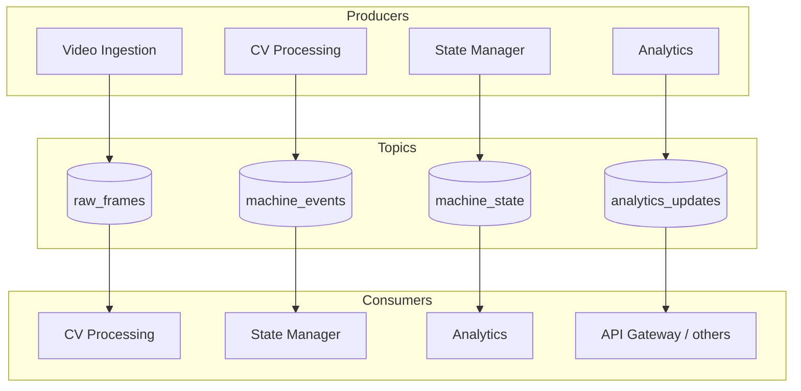

# Kafka in Eaglevision

This document explains **how Apache Kafka is used** in the Eaglevision project: why it exists, how services connect to it, which **topics** carry which kinds of data, and how messages flow through the pipeline.

For **project context and assessment goals**, see [`00-PROJECT-OVERVIEW.md`](00-PROJECT-OVERVIEW.md).

It is focused on **behavior and contracts**, not on low-level client code. The goal is to help anyone on the team, especially junior engineers, reason about streaming before reading producers and consumers in the codebase.

---

## 1. Why Kafka is here

Eaglevision processes **video** through several backend stages: ingestion, computer vision, state management, and analytics. Those stages do not all run at the same speed, and they should not block each other with ad-hoc direct calls for the **main** flow.

**Kafka** is the **main communication channel** for the platform:

- **Backend ↔ Backend:** services **publish** and **consume** named **topics** so the pipeline stays decoupled and scalable.
- **Frontend ↔ Backend:** the **API Gateway** connects the Next.js app to that same model — it **produces and consumes Kafka topics** and exposes **HTTP / WebSockets** to the browser. The browser does **not** speak the Kafka protocol directly, but **live semantics** are **Kafka-backed** through the gateway.

Supporting pieces (PostgreSQL, occasional REST) exist for **persistence** and **queries**, but **Kafka is the spine** for event-driven behavior end to end.

---

## 2. A simple mental model

If the architecture overview is a factory line, Kafka is the **conveyor belt between workstations**:

- each **topic** is a **labeled lane** on the belt
- **producers** place items on the lane
- **consumers** take items off the lane and do the next step of work

Nothing on the belt is stored forever as the system of record. Long-term history and reporting numbers live in **PostgreSQL**. Kafka is for **moving work in progress** and **events** — between services, and **through the gateway** for what operators see in real time.

---

## 3. What those words mean in simple terms

- **Broker** — the Kafka server process that holds topics and serves clients.
- **Topic** — a named stream of records (like a category of messages).
- **Partition** — a shard of a topic for parallelism; more partitions allow more consumers in parallel later.
- **Producer** — a service that **writes** messages to a topic.
- **Consumer** — a service that **reads** messages from a topic (usually as part of a **consumer group**).
- **Consumer group** — a set of consumers that share the work of a topic; each message is typically delivered to **one** consumer in the group.
- **Offset** — a position in a partition; consumers commit offsets to remember where they left off.

You do not need to master all of this on day one. For Eaglevision, it is enough to know **which topic connects which services** and **what direction data flows**.

---

## 4. How Kafka runs in this repository (local development)

In development, Kafka runs **inside Docker** as part of `docker-compose.yml`.

- **Image:** `apache/kafka:3.8.1` in **KRaft** mode (Kafka runs without ZooKeeper).
- **Service name on the Docker network:** `kafka`
- **Bootstrap address for clients inside Compose:** `kafka:29092` (internal listener).
- **Host access from your machine:** `localhost:${KAFKA_HOST_PORT:-9092}` (default **9092**).

Services receive `KAFKA_BOOTSTRAP_SERVERS` (for example `kafka:29092`) via environment variables so they can connect without hardcoding.

### Topic bootstrap

**Automatic topic creation is disabled** in the broker (`KAFKA_AUTO_CREATE_TOPICS_ENABLE: "false"`). Topics are created explicitly at startup by a one-shot **`kafka-init`** container that reads topic names from:

`src/dev/kafka/topics.txt`

That keeps topic names **visible in version control** and avoids surprises from auto-created topics with wrong partition counts.

---

## 4.1 Frontend and the browser edge (how it still “uses Kafka”)

End users do not open a TCP connection to port `9092` from Chrome. The pattern is:

1. **Next.js** talks to the **API Gateway** over normal web protocols (`HTTP`, **WebSockets**, or similar).
2. The **gateway** is a **Kafka client**: it **consumes** topics the UI cares about (for example streaming updates) and **produces** when the UI must inject commands into the pipeline.
3. So **Kafka remains the main communication channel** for **system semantics**: frontend and backend stay aligned on **topics**, with the gateway translating between web protocols and Kafka.

---

## 5. Topic pipeline overview

These are the **four** topics defined for the Eaglevision pipeline. They form a **chain** from raw video-related data toward analytics-oriented signals.

```mermaid
flowchart LR
    VI[Video Ingestion]
    T1[(raw_frames)]
    CV[CV Processing]
    T2[(machine_events)]
    SM[State Manager]
    T3[(machine_state)]
    AN[Analytics]
    T4[(analytics_updates)]
    GW[API Gateway / future consumers]

    VI -->|produce| T1
    T1 -->|consume| CV
    CV -->|produce| T2
    T2 -->|consume| SM
    SM -->|produce| T3
    T3 -->|consume| AN
    AN -->|produce| T4
    T4 -->|consume| GW
```

### How to read this diagram

Read it from left to right:

1. ingestion produces **raw frame** traffic
2. CV consumes it and produces **machine-level observations**
3. state management turns those into **state over time**
4. analytics turns state into **metrics and signals**
5. optional **analytics** notifications can fan out to the gateway or other consumers

---

## 6. Topic-by-topic reference

### 6.1 `raw_frames`

| | |
| --- | --- |
| **Role** | Carries **frame-level** input from video ingestion toward the CV pipeline. |
| **Produced by** | Video Ingestion Service |
| **Consumed by** | CV Processing Service |
| **Purpose** | Decouple **reading and packaging video** from **heavy inference** so CV can scale or restart independently. |

**What to expect in messages (conceptually):**

- frame or encoded payload (exact format is an implementation decision)
- metadata such as source id, timestamp, sequence number

---

### 6.2 `machine_events`

| | |
| --- | --- |
| **Role** | Carries **structured observations** after detection and tracking. |
| **Produced by** | CV Processing Service |
| **Consumed by** | State Manager Service |
| **Purpose** | Represent “what the model saw” for each machine or track, **before** long-term dwell and utilization rules are applied. |

**What to expect in messages (conceptually):**

- machine or track identity
- bounding box or geometry
- activity or motion hints
- timestamp

---

### 6.3 `machine_state`

| | |
| --- | --- |
| **Role** | Carries **state summaries** after idle, active, and dwell logic. |
| **Produced by** | State Manager Service |
| **Consumed by** | Analytics Service |
| **Purpose** | Turn a stream of short-lived events into **durable operational state** suitable for aggregation. |

**What to expect in messages (conceptually):**

- machine id
- active vs idle (or richer state)
- dwell-related timing fields as appropriate

---

### 6.4 `analytics_updates`

| | |
| --- | --- |
| **Role** | Carries **signals that new analytics are available** or **incremental analytics events**. |
| **Produced by** | Analytics Service |
| **Consumed by** | API Gateway and/or other subscribers (future) |
| **Purpose** | Decouple **writing analytics** from **pushing updates** to the gateway or other consumers without polling the database for every change. |

Exact payload shapes can evolve; treat this topic as the **contract for “analytics changed”** notifications.

---

## 7. End-to-end flow in one picture

This diagram matches the **main pipeline** described in [`01-ARCHTICUTRE.md`](01-ARCHTICUTRE.md), but highlights only Kafka boundaries.

CV, State Manager, and Analytics appear **twice** on purpose: each service is a **consumer** of the previous topic and a **producer** to the next.

---

## 8. Communication rules (Kafka vs everything else)

| Path | Mechanism | Notes |
| --- | --- | --- |
| Service → Service (pipeline) | **Kafka topics** | Primary pattern for ingestion → CV → state → analytics. |
| Frontend ↔ Backend (events) | **Kafka via API Gateway** | Gateway **produces/consumes** topics; browser **only** talks to the gateway over **HTTP / WebSockets**. |
| Service → Database | **SQL** (PostgreSQL) | durable storage, queries, reporting — not the primary event bus. |
| Browser ↔ Gateway (transport) | **HTTP / WebSockets** | **Wire** protocol only; **meaning** of live traffic is still tied to **Kafka** on the server side. |

### Beginner-friendly rule of thumb

- if it is **between processing services**, think **Kafka topics**
- if it is **live dashboard ↔ backend behavior**, think **API Gateway + Kafka** (gateway is the bridge)
- if it is **historical or queryable** business data, think **PostgreSQL**

---

## 9. Configuration and environment

The following are the main knobs you will see in development:

| Variable | Typical meaning |
| --- | --- |
| `KAFKA_BOOTSTRAP_SERVERS` | Comma-separated list of brokers; inside Docker Compose this is usually `kafka:29092`. |
| `KAFKA_HOST_PORT` | Host port mapped to Kafka’s external listener (default **9092**). |

Client libraries (planned: **confluent-kafka** with Python services) use the bootstrap servers to discover the cluster and produce or consume.

---

## 10. Local development operations (Makefile and Compose)

Common workflows:

- **Start backend + Kafka + Postgres (no Next.js container):** `make dev`
- **Start full stack including Next.js in Docker:** `make dev-app`
- **Rebuild backend services after code or Dockerfile changes:** `make rebuild-dev`

Topic names are edited in **`src/dev/kafka/topics.txt`**. After changing them, restart the stack so **`kafka-init`** can run again (or manage topics manually with `kafka-topics.sh` in a running container).

---

## 11. Design choices and tradeoffs

### Why disable auto-create topics?

- **Predictability** — topic names and partition counts stay explicit.
- **Operations** — fewer surprises in staging and production.
- **Team discipline** — topic creation is a **documented** change next to `topics.txt`.

### Why single-node Kafka in development?

Local development optimizes for **simplicity**. Production would use **replication**, **more brokers**, **security**, and stricter retention policies.

### Message size and video data

Frames can be large. The **exact** encoding (for example compressed images vs references) is an implementation detail, but the team should keep **Kafka message size limits** in mind and avoid putting raw uncompressed video in a single message without a strategy.

---

## 12. Kafka and PostgreSQL together

| Kafka | PostgreSQL |
| --- | --- |
| **Streaming** and **decoupling** | **Persistence** and **querying** |
| Great for moving events between services | Great for dashboards and reports |
| Retention is **time- and policy-bound** | Data can live as long as **you** need |

Kafka is the **moving conveyor**. PostgreSQL is the **warehouse** where finished analytics and history live.

---

## 13. Future extensions (not requirements yet)

These are natural next steps as the system matures:

- **More partitions** on hot topics when CV processing needs more parallelism
- **Consumer lag metrics** and alerting
- **Schema registry** if message formats evolve often
- **Replay** of topics for debugging or reprocessing after bug fixes
- **Dead-letter topics** for poison messages that cannot be parsed

---

## 14. Common terms (quick glossary)

| Term | Meaning |
| --- | --- |
| **Bootstrap server** | Initial host:port used to discover the cluster. |
| **Record / message** | One unit of data in a topic. |
| **Serialization** | How records are encoded (for example JSON in early designs). |
| **Lag** | How far a consumer is behind the latest message in a partition. |

---

## 15. Summary

| Idea | What to remember |
| --- | --- |
| **Role of Kafka** | Main channel for **service↔service** events and for **frontend↔backend** semantics **via the API Gateway** (browser → gateway over HTTP/WebSockets; gateway ↔ Kafka). |
| **Topics** | `raw_frames` → `machine_events` → `machine_state` → `analytics_updates`. |
| **Not** | A replacement for PostgreSQL; the browser does not speak the Kafka protocol directly. |
| **Local setup** | Docker broker, explicit topics from `src/dev/kafka/topics.txt`, bootstrap `kafka:29092` inside Compose. |

---

## Related documentation

- [`00-PROJECT-OVERVIEW.md`](00-PROJECT-OVERVIEW.md) — project overview, problem statement, and goals
- [`01-ARCHTICUTRE.md`](01-ARCHTICUTRE.md) — high-level architecture, layers, and communication diagrams
- [`initial-plan.md`](initial-plan.md) — original stack and topic list
- [`plans/01-codebase-building.md`](plans/01-codebase-building.md) — repository layout and Docker-first setup
