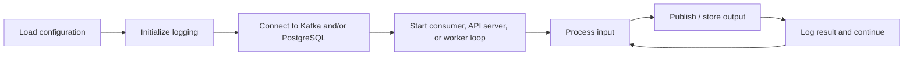
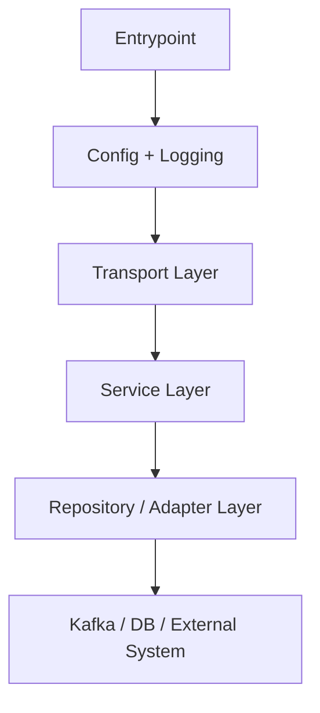
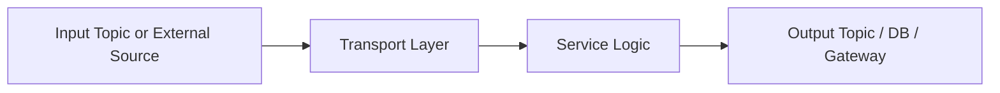
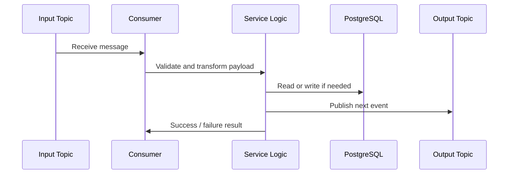

# Microservices in Eaglevision

This document explains the **generic structure** that all Eaglevision backend microservices should follow.

For **project context**, start with [`00-PROJECT-OVERVIEW.md`](00-PROJECT-OVERVIEW.md).  
For **system-wide architecture**, see [`01-ARCHTICUTRE.md`](01-ARCHTICUTRE.md).  
For **Kafka communication**, see [`02-KAFKA.md`](02-KAFKA.md).

The goal of this document is to make service design **consistent**, **easy to reason about**, and **easy to extend** as we build the platform service by service.

---

## 1. Why we need a shared service structure

Eaglevision is not one large backend application. It is a set of **small, focused services** that work together.

That only works well if every service follows the same ideas:

- similar folder layout
- similar startup flow
- similar logging and configuration
- similar Kafka integration
- similar error handling
- similar testing approach

Without that consistency, every new service becomes a different mini-project, which makes the codebase harder to learn and maintain.

---

## 2. A simple way to think about a microservice

A microservice in Eaglevision is a **small worker with one job**.

Examples:

- one service reads video frames
- one service performs CV inference
- one service calculates machine state
- one service aggregates analytics
- one service exposes data to the UI

Each service should:

- have a **clear responsibility**
- receive input from **Kafka**, **PostgreSQL**, or external input
- perform one focused kind of work
- publish results to **Kafka**, write to **PostgreSQL**, or expose them through the **API Gateway**

### A simple mental model

Think of each service like a worker station in a production line:

- it receives input
- it performs one kind of processing
- it passes structured output to the next stage

That is the core idea behind the service structure.

---

## 3. Core principles every service should follow

### 3.1 One responsibility per service

Each service should own **one main concern**.

Good examples:

- ingestion service handles video/frame input
- CV service handles detection and tracking
- state service handles state transitions and dwell logic
- analytics service handles aggregation and persistence

Bad examples:

- one service doing CV, analytics, and API serving together
- one service owning unrelated topics and unrelated DB logic

### 3.2 Clear input and output boundaries

Every service should clearly define:

- what it **consumes**
- what it **produces**
- what it **stores**
- what it **does not own**

This should be understandable before reading the implementation.

### 3.3 Configuration from environment

No service should hardcode:

- Kafka brokers
- topic names
- database URLs
- ports
- feature flags

All configuration should come from environment variables, loaded through shared config code in `src/common`.

### 3.4 Shared contracts

If two services exchange data, they should not each invent their own shape independently.

Use shared models from `src/common` for:

- Kafka payloads
- internal domain models
- response contracts where needed

### 3.5 Structured logging

Every service should produce logs that clearly show:

- service name
- event being processed
- success / failure
- IDs like machine id, track id, topic, partition, or request id where relevant

### 3.6 Small, replaceable modules

Inside a service, code should still be split into small pieces so we can replace logic later without rewriting the whole service.

---

## 4. Generic service lifecycle

Every backend service should roughly follow the same runtime lifecycle.



### Step-by-step

#### Step 1: Load configuration

Read environment variables and validate required settings.

#### Step 2: Initialize logging

Set service name, log level, and any structured logging fields.

#### Step 3: Connect dependencies

Create Kafka producers and consumers, database connections, or external model/runtime objects.

#### Step 4: Start the main loop

Depending on the service, this may be:

- a Kafka consumer loop
- an API server
- a scheduled worker
- a video processing loop

#### Step 5: Process input

Handle one unit of work at a time in a predictable path.

#### Step 6: Produce output

Write the result to the next Kafka topic, database table, or response channel.

#### Step 7: Continue safely

Log the outcome, commit offsets when appropriate, and move to the next unit of work.

---

## 5. Generic folder structure

Each service under `src/services/` should follow the same broad shape.

```text
src/services/<service_name>/
├── Dockerfile
├── README.md
├── __init__.py
├── main.py
├── config.py
├── consumer.py          # if the service reads Kafka
├── producer.py          # if the service writes Kafka
├── models.py            # service-specific internal models
├── service.py           # main business logic / orchestration
├── handlers/            # input handlers or message handlers
├── repositories/        # DB access or external data access
├── adapters/            # wrappers for CV libs, APIs, or integrations
├── tests/
│   ├── unit/
│   └── integration/
└── README.md
```

### Notes

- Not every service needs every file.
- A pure API service may not need `consumer.py`.
- A pure stream processor may not need `repositories/` at first.
- The important part is **consistency**, not forcing empty abstractions.

### Minimum expected files

At minimum, a service should usually have:

- `Dockerfile`
- `README.md`
- `main.py`
- `config.py`
- `service.py`
- `tests/`

---

## 6. Internal layers inside a service

Even though this is a microservice architecture, each individual service should also have **internal structure**.

### Recommended internal layers



### 6.1 Entrypoint layer

This is where the service starts.

Examples:

- `main.py`
- worker bootstrap
- API startup module

Responsibilities:

- wire dependencies together
- start the main runtime loop
- handle graceful shutdown

### 6.2 Config and logging layer

This layer loads environment settings and initializes logging.

It should mostly rely on `src/common`.

### 6.3 Transport layer

This is how work enters or exits the service.

Examples:

- Kafka consumers
- Kafka producers
- HTTP route handlers
- WebSocket handlers

This layer should stay thin. It should convert incoming data into internal models and pass them to the service layer.

### 6.4 Service layer

This is the heart of the service.

Responsibilities:

- business logic
- orchestration
- validation beyond schema parsing
- calling repositories and adapters
- deciding what output should be produced

This is where the “real thinking” of the service lives.

### 6.5 Repository / adapter layer

This layer talks to external systems.

Examples:

- PostgreSQL queries
- OpenCV / model wrappers
- third-party APIs
- file storage

The service layer should use this layer instead of embedding raw database or integration code everywhere.

---

## 7. Communication pattern inside services

Eaglevision is **Kafka-first**, so most services will follow the same basic communication shape.



### Common examples

| Service type | Input | Output |
| --- | --- | --- |
| **Stream processor** | Kafka topic | Kafka topic |
| **Aggregator** | Kafka topic | PostgreSQL + Kafka topic |
| **API Gateway** | Kafka + PostgreSQL | HTTP / WebSocket to frontend |
| **Ingestion service** | video source | Kafka topic |

### Rule of thumb

- Kafka messages enter through a **consumer**
- business logic happens in **service.py**
- output leaves through a **producer** or **repository**

---

## 8. Example service flow

This generic example fits most pipeline services.



### What this means in practice

1. a message arrives
2. the consumer parses it
3. the service logic processes it
4. optional DB work happens
5. the next message is published
6. logs and offset handling happen after that

---

## 9. Generic responsibilities all services should handle

No matter what a service does, it should think about these concerns.

### 9.1 Configuration validation

Fail early if required values are missing.

### 9.2 Input validation

Kafka payloads, requests, or external inputs should be validated immediately.

### 9.3 Error handling

A bad message or transient dependency issue should not crash the whole service silently.

Each service should define:

- retryable failures
- non-retryable failures
- logging behavior
- whether a message should be skipped, retried, or sent to a future dead-letter flow

### 9.4 Idempotency where needed

If a message is retried, the service should avoid creating duplicated side effects where practical.

### 9.5 Observability

We should be able to answer:

- what message was processed?
- did it succeed?
- what was emitted next?
- how long did it take?

### 9.6 Graceful shutdown

Services should close Kafka connections, flush producers, and shut down cleanly.

---

## 10. Service README expectations

Each service should have a small `README.md` that answers:

1. What does this service do?
2. What topics does it consume?
3. What topics does it produce?
4. Does it use PostgreSQL?
5. How do you run it locally?
6. What is the minimal “done” behavior for this service?

This makes each service understandable without reading code first.

---

## 11. Testing structure

Each service should aim for two levels of tests.

### 11.1 Unit tests

Focus on pure logic:

- activity classification logic
- dwell calculations
- transformations
- validation rules

### 11.2 Integration tests

Focus on real boundaries:

- consuming Kafka messages
- producing Kafka messages
- DB interaction
- startup and dependency wiring

### Testing rule of thumb

If a function can be tested without Kafka or Docker, keep it in unit tests.  
If it depends on real Kafka, Postgres, or service startup behavior, treat it as integration.

---

## 12. New service checklist

Before calling a new service “ready,” it should have:

- clear service purpose
- defined input topics or inputs
- defined output topics or outputs
- env-driven configuration
- Dockerfile
- startup entrypoint
- logging
- validation
- tests
- README

---

## 13. Recommended build order

To keep the system buildable in stages, the services should generally be implemented in this order:

1. **Video Ingestion Service**
2. **CV Processing Service**
3. **State Manager Service**
4. **Analytics Service**
5. **API Gateway**

This order follows the natural direction of the pipeline and reduces rework.

---

## 14. Summary

Every Eaglevision microservice should look and behave like a **small, focused worker** with:

- one clear responsibility
- consistent config and logging
- thin transport code
- business logic in a dedicated service layer
- clean Kafka and database boundaries
- predictable startup and shutdown
- service-level documentation and tests

If we keep that structure consistent, the whole platform will be much easier to build service by service.

---

## Related documentation

- [`00-PROJECT-OVERVIEW.md`](00-PROJECT-OVERVIEW.md) — project overview, problem statement, and goals
- [`01-ARCHTICUTRE.md`](01-ARCHTICUTRE.md) — system architecture, layers, communication, and data flow
- [`02-KAFKA.md`](02-KAFKA.md) — Kafka topics, producer/consumer flow, and broker usage
